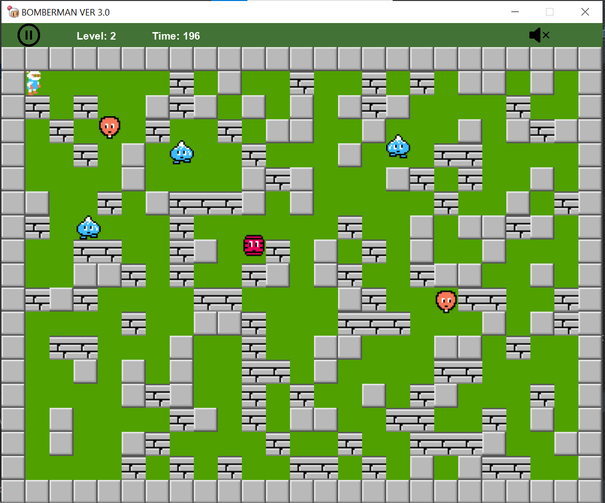

# Bài tập lớn OOP - Bomberman Game

# ☘ Contributors
- [Khương Vũ Trâm Anh (21020104) -K66-C-A-CLC3.](https://github.com/tramanh1511)
- [Đinh Thị Trà My (21020049) -K66-C-A-CLC2.](https://github.com/tramy132)
- [Đỗ Thị Trang (210215450 -K66-C-A-CLC2.](https://github.com/ChuppySuidae)

- Link github: https://github.com/tramanh1511/Bomberman.git

# ☘ Introduction
- Bài tập lớn - Bomberman (UET) - INT2204 44 - Lập trình hướng đối tượng
- Relax & enjoy the game :))

# ☘ Features
- Người chơi tự di chuyển Bomber.
- Có thể để 2 người chơi cùng nhau.
- Đặt và kích hoạt Bomb.
- Có các Enemy cản trở người chơi đến vị trí Portal.
- Có các Item cũng được giấu phía sau Brick và chỉ hiện ra khi Brick bị phá hủy.
- ...

# ☘Technologies
- IntelliJ IDEA Community Edition 2022.
- JavaFX vesion 19.

# ☘Guide
- Run -> Edit Configurations... -> Add new run configuration... -> Application 
- Main class: Main.java
- Name: Main
- Modify options -> Add VM options VM options: -module-path "\path\to\javafx-sdk-19\lib" --add-modules javafx.controls,javafx.fxml

# ☘Preview
